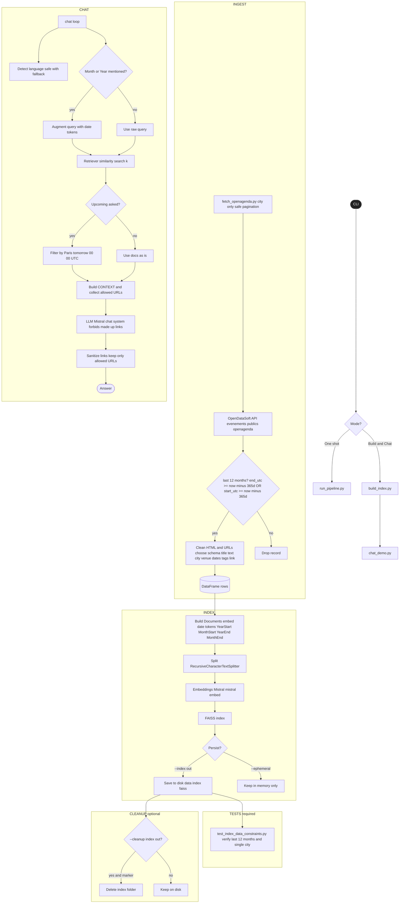

 
---

# rag-openagenda

Retrieval-Augmented Generation (RAG) POC that recommends and answers questions about **public cultural events** using the OpenDataSoft **OpenAgenda** dataset. The system ingests **city-filtered** events from the **last 12 months** (and any future events listed), builds a **FAISS** vector index with **Mistral** embeddings, and answers via a retrieval-first chatbot orchestrated with **LangChain**.

* **Scope:** city-level (you choose the city at run time)
* **Freshness rule:** keep events whose **end** (preferred) or **start** ≥ *now − 365 days* (UTC)
* **No hallucinations:** answers come **only** from retrieved context; model-invented URLs are stripped
* **Date-aware retrieval:** normalized date tokens (e.g., `YearStart: 2025`, `MonthStart: 06`) embedded in text
* **“Upcoming”** = from **tomorrow (Europe/Paris)** onward when the user asks
* **Language:** auto-detects the question’s language and answers in it (safe fallback configurable)

---

## Objectives

* Configure a reproducible environment and clean dependency management
* Ingest, clean, and filter OpenAgenda events (≤ 12 months) for a **selected city**
* Build a **FAISS** vector index with **Mistral** embeddings and **date tokens** embedded in text
* Implement a **LangChain**-based RAG chatbot that answers **only** from retrieved context
* Provide a **unit test** verifying the integrated data in the vector DB meets **time** and **city** constraints

---

## Dataset

* **Dataset name (OpenDataSoft):** `evenements-publics-openagenda`
* **API base:** `https://public.opendatasoft.com/api/records/1.0/search/`
* We use a **city-only** filter and respect the platform’s **10k results window** (offset + rows ≤ 10 000).

---

## Pipeline overview (Mermaid)



---

## Requirements

* **Python 3.10+**
* A **Mistral API key** (for embeddings & chat)

---

## Setup

```bash
# from project root
python -m venv .venv
source .venv/bin/activate          # Windows: .venv\Scripts\activate
pip install -r requirements.txt
```

Create a `.env` file (root of the repo):

```bash
cp .env.example .env
# then edit .env and set:
# MISTRAL_API_KEY=your_actual_key_here
```

> If you see a tokenizer warning from `langchain_mistralai`, it’s harmless.

---

## Build an index (per city)

```bash
# Paris
python -m src.index.build_index --city "Paris" \
  --out data/index/faiss_paris --max-records 9000

# Strasbourg
python -m src.index.build_index --city "Strasbourg" \
  --out data/index/faiss_strasbourg --max-records 9000
```

Notes:

* Use quotes for cities with spaces/hyphens: `"Aix-en-Provence"`, `"Saint-Étienne"`.
* `--max-records` keeps runtime reasonable and stays under the 10k window.

---

## Chat on a saved index

```bash
python -m src.chat_demo --index data/index/faiss_paris --k 20
```

Tips:

* **k**: increase to 20–40 for big cities or month-specific queries.
* Ask in any supported language (en/fr/de/es/ar/it/nl/pt).
* Use **“upcoming / à venir”** to restrict answers to **from tomorrow** onward (Paris time).

---

## One-shot pipeline (build + chat)

```bash
python -m src.run_pipeline --city "Paris" \
  --max-records 9000 \
  --index-out data/index/faiss_paris \
  --k 20
```

Optional behaviors:

* `--ephemeral` → build the index in memory only (don’t save to disk)
* `--cleanup-index-out` → save for the session, then delete the index folder when you exit

---

## “Upcoming”, language & links — behavior

* **Upcoming filter:** triggers when the query contains *upcoming / coming up / next events / à venir / prochains / bientôt…*. It filters results to events whose **start or end** is **≥ tomorrow 00:00** **Europe/Paris**.
* **Language:** auto-detects the question’s language and answers in it (fallback: English; change with `--fallback-lang` in `run_pipeline.py`).
* **Links:** only shows URLs that exist in retrieved **context metadata** (`permalink`/`website`). Any model-invented links are stripped.

---

## Tests (project requirement)

This single test verifies that **data integrated into the FAISS index**:

* is **≤ 12 months** old, and
* belongs to a **single selected city**.

1. Build the index first:

```bash
python -m src.index.build_index --city "Paris" --out data/index/faiss --max-records 9000
```

2. Run the test:

```bash
python -m pytest -q tests/test_index_data_constraints.py
```

If your index is in another folder:

```bash
INDEX_DIR="data/index/faiss_paris" python -m pytest -q tests/test_index_data_constraints.py
```

---

## Project structure

```
final-rag-openagenda/
├─ README.md
├─ requirements.txt
├─ .env.example
├─ .env                 # (not committed) contains MISTRAL_API_KEY=...
├─ data/
│  └─ index/            # saved FAISS indexes (gitignored)
├─ src/
│  ├─ data/
│  │  └─ fetch_openagenda.py
│  ├─ index/
│  │  └─ build_index.py
│  ├─ chat_demo.py
│  └─ run_pipeline.py
├─ tests/
│  └─ test_index_data_constraints.py
└─ pytest.ini
```

---

## Troubleshooting

* **HTTP 400: “10000”**
  You hit the OpenDataSoft **10k window**. Our fetcher guards against this, but if you override params or request too many rows, reduce `--max-records` or keep the default pagination.

* **`ModuleNotFoundError: langchain_community` when testing**
  Always run pytest with the venv’s Python:

  ```bash
  python -m pytest -q tests/test_index_data_constraints.py
  ```

  Ensure `pip install -r requirements.txt` was done **inside** the venv.

* **Tokenizer warning from langchain\_mistralai**
  Safe to ignore. It falls back to a simple length heuristic for batching.

* **“I don’t know.” answers**
  Means the top-k retrieved context didn’t contain that fact within the last 12 months for the chosen city. Try increasing `--k` (e.g., 30–40) or adding a month/year in your question.

---

## Deliverables mapping

* **Readme file** (presentation, objectives, reproduction, folders) → `README.md`
* **Dependency management** → `requirements.txt`, `.env(.example)`
* **Pre-processing** → `src/data/fetch_openagenda.py` (HTML clean, last-year filter, URL normalize)
* **Vectorization & index mgmt** → `src/index/build_index.py` (Mistral embeddings + FAISS)
* **RAG system code** → `src/chat_demo.py`, `src/run_pipeline.py` (LangChain orchestration)
* **Unit test** (data constraints in vector DB) → `tests/test_index_data_constraints.py`

---

## Clean repo before pushing (optional)

```bash
# don’t commit artifacts or secrets
echo '.venv/
.env
__pycache__/
.pytest_cache/
*.pyc
data/index/
data/**/*.faiss
data/**/*.npy' >> .gitignore

# remove local artifacts before commit
rm -rf .venv .pytest_cache data/index
rm -f .env
```

---

## License / usage

This POC is intended for educational/demo purposes. Respect OpenDataSoft/OpenAgenda terms when querying and redistributing data.


